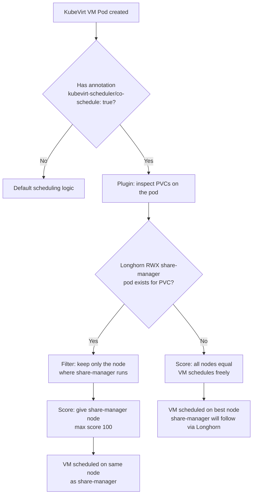
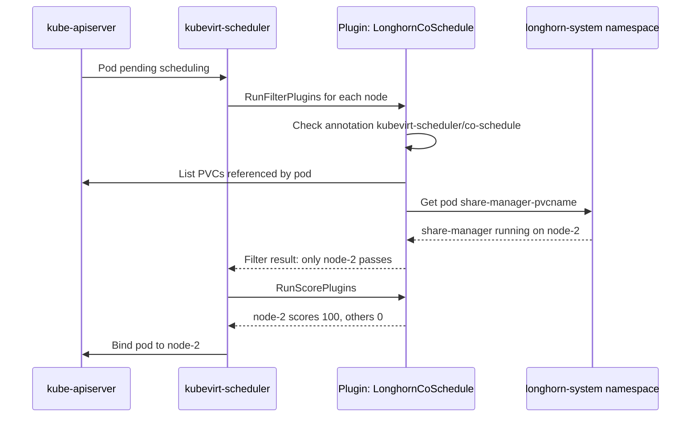

# KubeVirt Scheduler — Architecture Plan

## Problem Statement

When KubeVirt VMs use **Longhorn RWX** volumes, Longhorn creates a `share-manager` pod that serves an NFS share for that PVC. By default, this share-manager pod is scheduled independently of the VM pod, meaning the VM's NFS traffic crosses node boundaries — adding latency and network overhead.

**Goal:** Co-schedule the VM pod and its Longhorn share-manager pod on the **same node**, using a custom Kubernetes Scheduling Framework plugin with an opt-in annotation.

---

## Solution Overview

Build a **custom Kubernetes scheduler** (named `kubevirt-scheduler`) as a standalone binary that embeds the default `kube-scheduler` with an additional custom plugin registered. The plugin implements two extension points:

| Extension Point | Purpose |
|---|---|
| **Filter** | If a share-manager pod already exists for the VM's PVC, remove all nodes except the one where the share-manager runs |
| **Score** | If no share-manager pod exists yet, score nodes normally (plugin is a no-op); if one exists, give the share-manager's node the highest score |

The scheduler is **opt-in** via a pod annotation. Only pods with the annotation `kubevirt-scheduler/co-schedule: "true"` are processed by the plugin logic.

---

## Architecture



---

## Key Design Decisions

### 1. Opt-in Annotation
```
kubevirt-scheduler/co-schedule: "true"
```
Applied to the KubeVirt `VirtualMachineInstance` pod (the `virt-launcher` pod). KubeVirt propagates annotations from the VM spec to the virt-launcher pod.

### 2. Share-Manager Pod Discovery
Longhorn names share-manager pods with the pattern:
```
share-manager-<pvc-name>
```
in the `longhorn-system` namespace. The plugin will:
1. List all PVCs referenced by the pod being scheduled
2. For each PVC, look up `longhorn-system/share-manager-<pvc-name>`
3. If found and running, extract its `.spec.nodeName`

### 3. Plugin Extension Points

#### Filter Plugin (`LonghornCoScheduleFilter`)
- If annotation is absent → pass (allow all nodes)
- If annotation present and no share-manager found → pass (allow all nodes)
- If annotation present and share-manager found on node X → only pass node X, filter out all others

#### Score Plugin (`LonghornCoScheduleScore`)
- If annotation is absent → return score 0 (neutral)
- If annotation present and no share-manager found → return score 0 (neutral)
- If annotation present and share-manager found on node X → return score 100 for node X, 0 for all others

### 4. Scheduler Configuration
The custom scheduler runs as a **separate scheduler** (not replacing `kube-scheduler`). VMs opt-in by setting `spec.schedulerName: kubevirt-scheduler` in the VirtualMachine spec.

---

## Project Structure

```
kubevirt-scheduler/
├── cmd/
│   └── scheduler/
│       └── main.go                  # Entry point, registers plugin
├── pkg/
│   └── plugins/
│       └── longhorn_cosched/
│           ├── plugin.go            # Plugin struct, Name(), registration
│           ├── filter.go            # Filter extension point
│           ├── score.go             # Score extension point
│           ├── sharemanager.go      # Logic to find share-manager pod
│           └── plugin_test.go       # Unit tests
├── manifests/
│   ├── rbac.yaml                    # ClusterRole + ClusterRoleBinding
│   ├── scheduler-config.yaml        # KubeSchedulerConfiguration
│   └── deployment.yaml              # Deployment for the scheduler
├── Dockerfile
├── go.mod
├── go.sum
├── LICENSE
└── README.md
```

---

## Go Module Dependencies

| Dependency | Purpose |
|---|---|
| `k8s.io/kubernetes` | Scheduler framework (via `k8s.io/kube-scheduler`) |
| `k8s.io/client-go` | Kubernetes API client |
| `k8s.io/api` | Kubernetes API types |
| `k8s.io/apimachinery` | API machinery utilities |
| `sigs.k8s.io/scheduler-plugins` | Reference for plugin patterns |

> **Note:** The recommended approach is to use `k8s.io/kube-scheduler` as a library (the same pattern used by `scheduler-plugins` upstream project).

---

## RBAC Requirements

The scheduler needs the following permissions beyond the default scheduler:

```yaml
# Additional rules needed:
- apiGroups: [""]
  resources: ["pods"]
  verbs: ["get", "list", "watch"]          # To find share-manager pods
- apiGroups: [""]
  resources: ["persistentvolumeclaims"]
  verbs: ["get", "list", "watch"]          # To inspect PVCs on the pod
- apiGroups: [""]
  resources: ["persistentvolumes"]
  verbs: ["get", "list", "watch"]          # To check storage class
```

---

## Scheduler Configuration (KubeSchedulerConfiguration)

```yaml
apiVersion: kubescheduler.config.k8s.io/v1
kind: KubeSchedulerConfiguration
profiles:
  - schedulerName: kubevirt-scheduler
    plugins:
      filter:
        enabled:
          - name: LonghornCoSchedule
      score:
        enabled:
          - name: LonghornCoSchedule
```

---

## VM Usage Example

```yaml
apiVersion: kubevirt.io/v1
kind: VirtualMachine
metadata:
  name: my-vm
spec:
  template:
    metadata:
      annotations:
        kubevirt-scheduler/co-schedule: "true"
    spec:
      schedulerName: kubevirt-scheduler
      volumes:
        - name: datavol
          persistentVolumeClaim:
            claimName: my-rwx-pvc
```

---

## Sequence Diagram



---

## Implementation Steps

1. **Initialize Go module** — `go mod init github.com/yourusername/kubevirt-scheduler`
2. **Plugin skeleton** — implement `framework.Plugin`, `framework.FilterPlugin`, `framework.ScorePlugin` interfaces
3. **Share-manager lookup** — query `longhorn-system` namespace for `share-manager-<pvc-name>` pods
4. **Filter logic** — if share-manager found, return `framework.NewStatus(framework.Unschedulable)` for non-matching nodes
5. **Score logic** — return `framework.MaxNodeScore` for the share-manager node
6. **Main entrypoint** — use `scheduler/app` to build the scheduler binary with the plugin registered
7. **Dockerfile** — multi-stage build, distroless final image
8. **Manifests** — RBAC, ConfigMap with scheduler config, Deployment
9. **Tests** — table-driven unit tests for filter and score logic using fake clients
10. **README** — installation and usage docs
